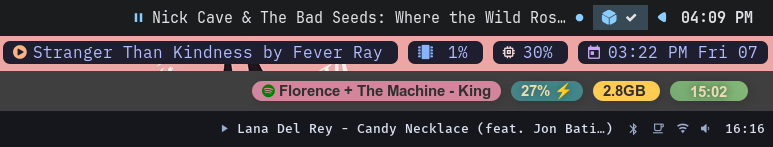

# Lystra

Lystra is a simple and small app that lets [Waybar](https://github.com/Alexays/Waybar) display what you're currently listening to by using DBus signals instead of polling.
  
## Features
- Customizable output format, including colors (see Usage below)
- Support for any [MPRIS](https://wiki.archlinux.org/title/MPRIS) mediaplayer of preference
- Automatic pause/resume when other media content begins/stops playing (ex. YouTube videos)
- Clearing of output when mediaplayer is closed
- No constant polling, Lystra only updates when a signal is received
  
Some examples of its output here:  
<p align="center">
    
</p>

## Installation from source
1. Make sure you've got Rust installed. Either via your distributions package manager or [`rustup`](https://rustup.rs/).
2. `cargo install --git https://github.com/stefur/lystra lystra`

## Configure Waybar
Add a custom module to your Waybar config, something like:  
```
"custom/lystra": {
    "format": "{icon} {}"
    "exec": "lystra",
    "return-type": "json"
    "format-icons": {
      "Playing": "󰐊",
      "Paused": "󰏤"
    },
    "max-length": 45
}
```  
Add whatever flags you want to the command in `exec`, for example something like: `"exec": "lystra --format '{{title}}: {{artist}}' --autotoggle"`

Don't forget to add the module to your bar!

## Usage
Currently the following options can be used to customize the output of Lystra.

| Flag | Default value | Description |
| --- | --- | --- |
| `--format` | "{{artist}} - {{title}}" | Format of output, using handlebar tags. |
| `--mediaplayer`| None | Mediaplayer interface that Lystra should listen to. Usually the name of the mediaplayer. Blank means listening to all mediaplayers. |
| `--autotoggle` | False | Include this flag to automatically pause/resume the mediaplayer if other media content playing is detected (for example a YouTube video) |

## Example
`lystra --format '{{title}} by {{artist}}' --mediaplayer 'spotify' --autotoggle`
